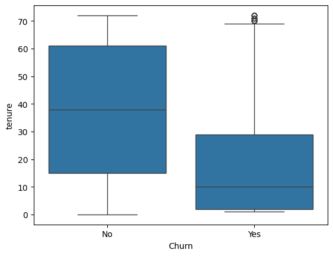
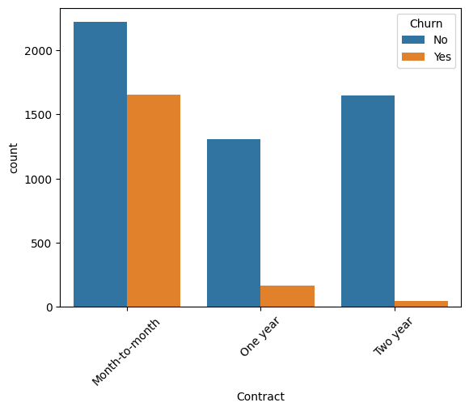
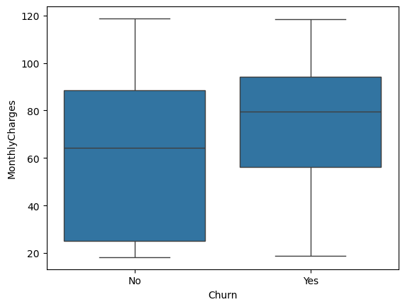
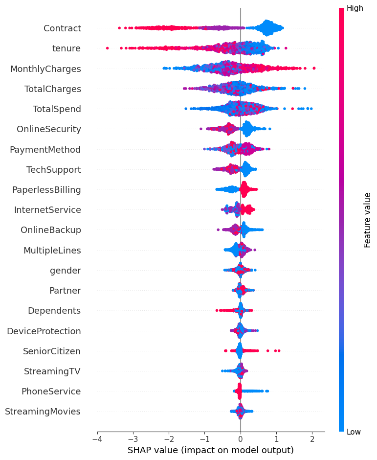
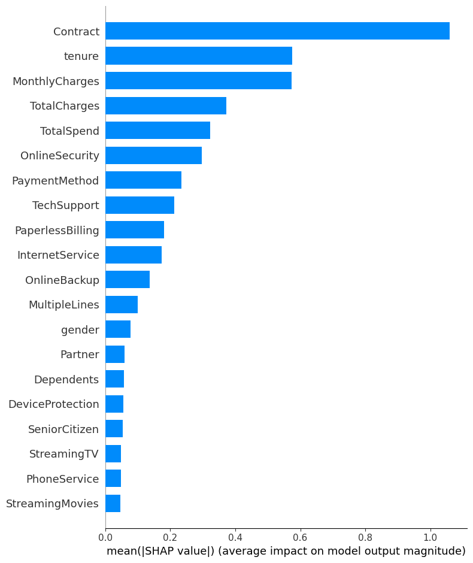
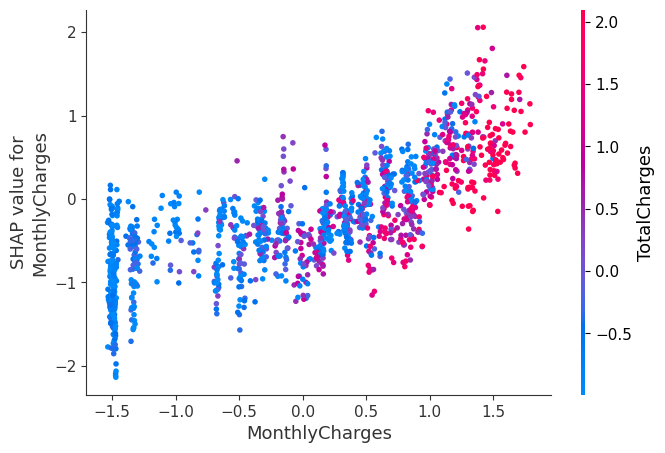

# Customer Churn Prediction using Machine Learning

🚀 **Live App:**  
https://customer-churn-predictionnn-ml.streamlit.app/

---

## Project Overview

Customer churn is a major challenge for subscription-based businesses such as telecom companies. When customers stop using a service, it leads to revenue loss and increased customer acquisition costs.

This project builds a **machine learning model to predict customer churn** using telecom customer data. By identifying customers who are likely to churn, businesses can implement proactive retention strategies.

---

## Business Problem

Customer retention is significantly cheaper than acquiring new customers. Predicting which customers are likely to leave allows companies to take preventive actions such as:

- Personalized offers
- Improved customer support
- Service upgrades
- Loyalty programs

This project uses machine learning to analyze customer behavior and predict churn probability.

---

## Dataset

Dataset used: **Telco Customer Churn Dataset**

📂 Dataset Source:  
https://www.kaggle.com/datasets/blastchar/telco-customer-churn

The dataset contains information about telecom customers including:

- Customer demographics
- Account information
- Services subscribed
- Billing details
- Customer tenure

### Target Variable

```
Churn (Yes / No)
```

---

## Project Workflow

### 1. Data Cleaning

- Removed unnecessary columns (`customerID`)
- Converted `TotalCharges` to numeric format
- Handled missing values
- Prepared the dataset for machine learning models

---

### 2. Exploratory Data Analysis (EDA)

Exploratory analysis was performed to understand patterns influencing churn.

Key visualizations include:

- Churn distribution
- Contract type vs churn
- Monthly charges vs churn
- Tenure vs churn
- Feature correlation analysis

## Project Visualizations

### Customer Churn Distribution


### Churn vs Tenure


### Contract Type Analysis


### Boxplot Analysis



### SHAP Summary Plot


### SHAP Summary Plot 2


### SHAP Dependence Plot


---

### 3. Feature Engineering

A new feature was created to represent customer value.

```
TotalSpend = MonthlyCharges × Tenure
```

This feature estimates the total amount a customer has spent during their subscription period.

---

### 4. Data Preprocessing

Preprocessing steps include:

- Encoding categorical variables
- Feature scaling using StandardScaler
- Splitting the dataset into training and testing sets

---

### 5. Machine Learning Models

The following models were trained and evaluated:

- Logistic Regression
- Random Forest Classifier
- XGBoost Classifier

Training multiple models allows comparison of performance and identification of the best algorithm.

---

## Model Evaluation

Models were evaluated using the following metrics:

- Accuracy
- Precision
- Recall
- F1 Score
- ROC-AUC Score

| Model | Accuracy |
|------|---------|
| Logistic Regression | ~80% |
| Random Forest | ~84% |
| XGBoost | ~86% |

The **XGBoost model** achieved the best performance.

---

## Explainable AI using SHAP

To understand how the model makes predictions, **SHAP (SHapley Additive exPlanations)** was used.

SHAP helps explain:

- Which features influence churn predictions
- How each feature contributes to model decisions

Key churn drivers identified:

- Contract type
- Tenure
- Monthly charges
- Internet service
- Total spend

---

## Key Business Insights

Analysis of the data revealed several important insights:

- Customers with **month-to-month contracts churn more frequently**
- Customers with **shorter tenure have higher churn probability**
- **Higher monthly charges increase churn risk**
- Customers without **online security or technical support services** tend to churn more often

These insights can help companies design better customer retention strategies.

---

## Technologies Used

- Python
- Pandas
- NumPy
- Matplotlib
- Seaborn
- Scikit-learn
- XGBoost
- SHAP
- Jupyter Notebook

---

## Requirements

To run this project, install the following Python libraries:

```
pandas
numpy
matplotlib
seaborn
scikit-learn
xgboost
shap
jupyter
```

Or install using:

```
pip install -r requirements.txt
```

---

## Project Structure

```
Customer_Churn_Prediction_ML
│
├── notebooks
│   └── Customer_Churn_Prediction.ipynb
│
├── data
│   └── Telco-Customer-Churn.csv
│
├── images
│   ├── churn_distribution.png
│   ├── roc_curve.png
│   ├── feature_importance.png
│   └── shap_summary.png
│
├── models
│   └── churn_model.pkl
│
├── requirements.txt
│
└── README.md
```

---

## Future Improvements

Possible improvements for this project:

- Deploy the model using **Streamlit**
- Build an interactive **Power BI dashboard**
- Perform **hyperparameter tuning**
- Implement **customer segmentation**

---

## Author

**Shahawaj Pasha**

BSc Data Science Student  
Aspiring Data Analyst / Data Scientist
